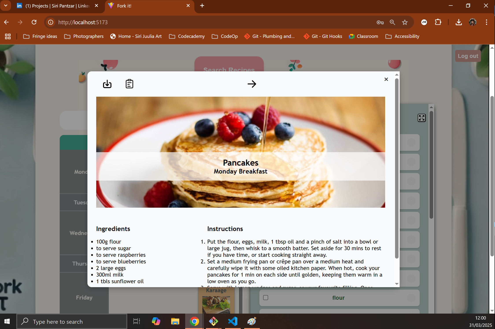
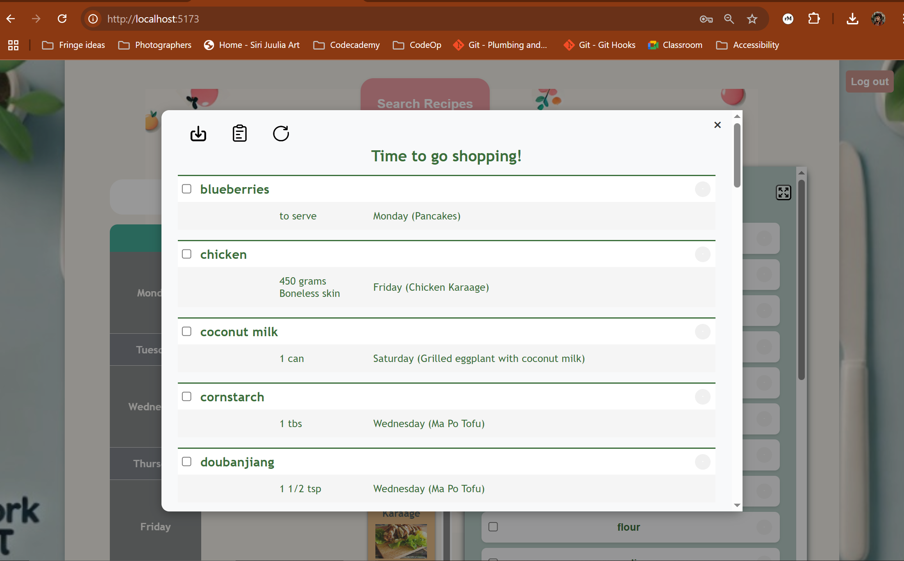
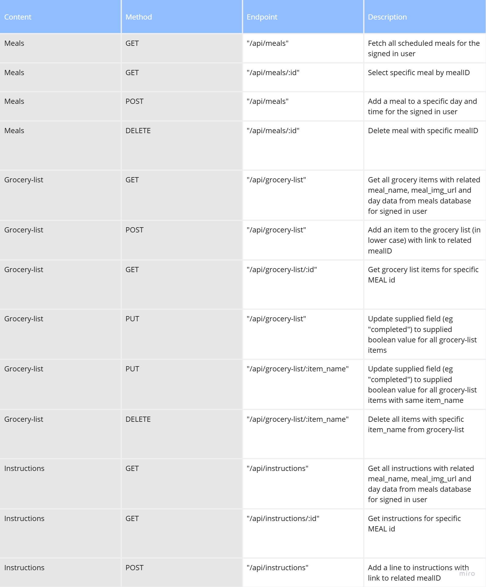

# FE PROJECT

This project is a Feature Extension Project for CodeOp's fullstack bootcamp. It extends a student MVP project.

## MVP - by Ikram El Malki Zekalmi

Fork it! is a web application designed to help users plan their meals for the week and generate a shopping list based on their selections. The goal is to provide an easy to use interface where users can add meals to specific days, track their grocery list, and manage their meal prep efficiently.

## Feature extension - by Siri Pantzar

The feature extension project introduced the following features:

- user authentication & authorisation using jwt and bcrypt and an axios interceptor
- a fully interconnected personal shopping list and recipe book using a relational MySQL database with users, meals, ingredients and instructions
- a "Shopping List" view with linked ingredient and meal data and PDF & clipboard export options
- a "Recipe Book" view with meal image, ingredient and instruction data and PDF & clipboard export options

### Recipe Book view

### Shopping List View

## Setup

### Dependencies

Run `npm install` in the project folder to install dependencies related to Express (the server).

`cd client` and run `npm install` install dependencies related to React (the client).

### Database Prep

This project uses MySQL, so make sure you have it installed. Run this command to create the tables: `npm run migrate`.

This will set up four tables:

- auth (for storing user data)
- meals (for storing meal overview data)
- grocery_list (for tracking ingredients)
- instructions (for storing recipe instructions)

### Run Your Development Servers

- Run `npm start` in project directory to start the Express server on port 3001
- `cd client` and run `npm run dev` to start client server in development mode with hot reloading in port 5173.
- Client is configured so all API calls will be proxied to port 3001 for a smoother development experience.
- You can test your client app in `http://localhost:5173`
- You can test your API in `http://localhost:3001/api`

## API ENDPOINTS

### Thoughts on feature extensions

- Drag-and-Drop Calendar: Allow users to move meals around.
- Nutritional Insights: Show calorie and macro breakdown for meals.

#### CREDIT

MVP Built by: Ikram El Malki Zekalmi.
FE Built by: Siri Pantzar.
Icons: Icon8

For: CodeOp Fullstack Bootcamp
